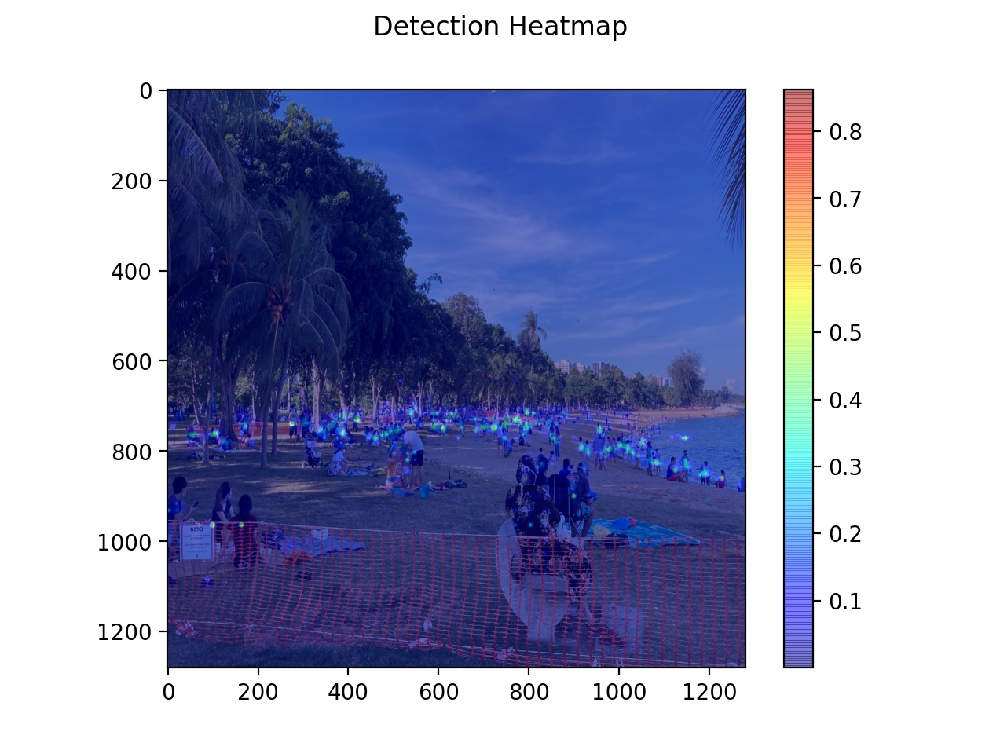
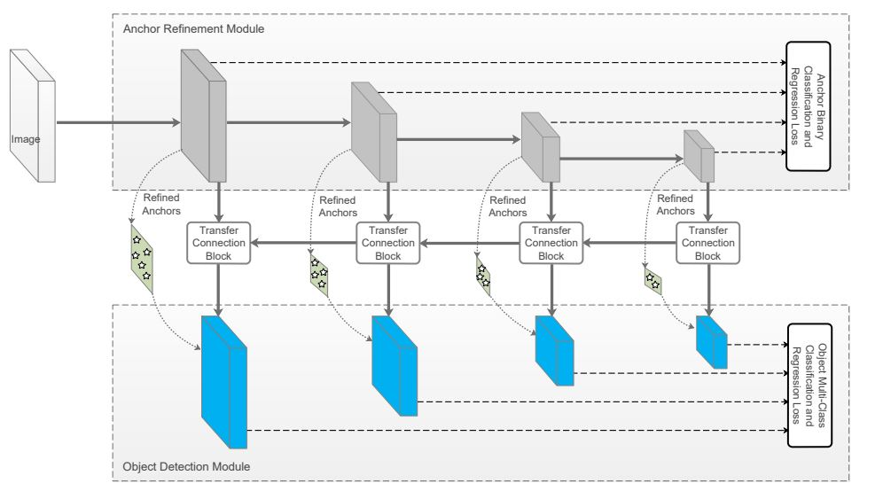

# Fully Convolutional One-Stage Object Detection (FCOS)
This repository contains my implementation of the Fully Convolutional One-Stage Object Detection ([FCOS](https://arxiv.org/abs/1904.01355)) object detection architecture. Please note that the codes in this repository is still work-in-progress.

## Architecture of FCOS
As shown in Fig. 1, the FCOS architecture includes the Feature Pyramid Network (FPN) but adds separate classification and regression heads. In this code, the original FCOS algorithm is modified to follow a regression similar to that of [YOLOv3](https://arxiv.org/abs/1804.02767). This code also assigns one target label in its corresponding feature map (P3 to P7) based on the centroid of the bounding box. In particular, the regression has the form:
```
x_off = sigmoid(feature_map[x, y]) * stride
y_off = sigmoid(feature_map[x, y]) * stride
box_w = sigmoid(feature_map[x, y]) * feature_scale * stride
box_h = sigmoid(feature_map[x, y]) * feature_scale * stride
```
and the regression outputs are given by `[x_off, y_off, box_w, box_h]`.

Other modifications include retaining batch normalisation instead of group normalisation as well as the use of the C5 output rather than the P5 output. The input image is also resized to dimensions of 512 by 512 or 640 by 640, ignoring the aspect ratio, depending on the processing capabilities of the GPU hardware. In general, an Nvidia Quadro P1000 graphics card is able to train on a 512 by 512 image using the COCO dataset.


Fig. 1: The original FCOS Architecture (as shown in the [FCOS](https://arxiv.org/abs/1904.01355) paper).

## Dataset
The model formats the bounding boxes in the VOC format with normalised coordinates (xmin, ymin, xmax, ymax) and generates the ground truth labels accordingly. For the COCO dataset, run
```
python process_COCO_annotations_fcos.py
python format_COCO_fcos.py
```
to obtain the normalised bounding boxes in the relevant format, followed by
```
python train_fcos_coco.py
```
to train the model.

## Training
The model is trained using SGD with a momentum of 0.9 and a batch size of 16. The training schedule follows that in the paper, and horizontal flipping is applied as the only data augmentation step.

## Inference
To perform inference, run
```
python infer_fcos_coco.py -t 0.30 -u 0.25 -s false -i kite.jpg
```
which generates the heatmap of detected objects as well as the boxes of the detected objects.

## Pre-Trained Models
The modified FCOS model is trained using an Nvidia V100 32GB GPU with the input image dimensions set to 1280 by 1280. The pre-trained models can be downloaded via:

| Model Name | Link |
| ---------- | ---- |
| COCO dataset | https://github.com/WD-Leong/CV-FCOS/releases/download/v0.9/coco_model_1280.zip |
| COCO (Person) and Crowd Human | https://github.com/WD-Leong/CV-FCOS/releases/download/v0.9/person_model_1280.zip |
| Crowd Human (Face) dataset | https://github.com/WD-Leong/CV-FCOS/releases/download/v0.9/crowd_human_model_1280.zip |

The COCO model is trained for 1x LR schedule (90k iterations), the COCO (Person) and Crowd Human model is trained for 77.5k iterations and the Crowd Human (Face) model is trained for 20k iterations. The COCO (Person) and Crowd Human model is trained to detect humans and will be referred to as the Person model in the later sections.

## Inference only
To perform inference using the pre-trained model, run either of the following codes
```
python infer_fcos_coco.py -t 0.30 -u 0.25 -s true -r true -i <path_to_image_jpeg_file>
python infer_fcos_crowd.py -t 0.30 -u 0.25 -s true -r true -i <path_to_image_jpeg_file>
python infer_fcos_people.py -t 0.30 -u 0.25 -s true -r true -f 0.50 -i <path_to_image_jpeg_file>
```
for the COCO model, Crowd Human (Face) model or Person model respectively. Note that the model should be saved in a folder `TF_Models` which is one level above the `infer_fcos_<model>.py` code.

## Sample Detection Results
A sample of the detection results are provided in this section.

| Model | Detection Heatmap | Detection Results |
| ----- | ----------------- | ----------------- |
| COCO |  |  |
| Person |  |  |

Some further results of the Crowd Human (Face) and Person models:
| Model | Detection Results |
| ----- | ----------------- |
| Person |  |
| Person |  |
| Crowd Human (Face) |  |
| Crowd Human (Face) |  |

## RefineDet Enhancement
To further enhance the model, the concepts in [RefineDet](https://arxiv.org/abs/1711.06897) were incorporated in `fcos_refinedet_module.py`. In particular, RefineDet uses an Anchor Refinement Module (ARM) and an Object Detection Module (ODM) to enhance the detection results by allowing the ODM work further on the predictions in the ARM. 


Fig. 2: RefineDet architecture (taken from the [RefineDet](https://arxiv.org/abs/1711.06897) paper).

To initiate the training process, run 
```
python train_fcos_refinedet_coco.py
```
to train the FCOS-RefineDet model on the Microsoft COCO dataset, and
```
python infer_fcos_refinedet_coco.py -t 0.30 -u 0.25 -s true -i <image_file_name>.jpg
```
to perform inference.

Example of detection using FCOS RefineDet architecture:
| Heatmap | Detection |
| ------- | --------- |
|  | 

## Attention Enhancement
With attention mechanism from [Transformers](https://arxiv.org/abs/1706.03762) being increasingly applied to Computer Vision applications, the backbone model is enhanced with attention mechanism similar to [BoTNet](https://arxiv.org/abs/2101.11605).
